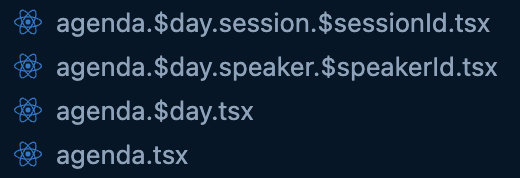

## Talk info

In this exercise we will create a modal to display the talk information.

Modal's we can render in nested routes.

Create 2 new routes:

* app/routes/agenda.$day.session.$sessionId.tsx
* app/routes/agenda.$day.speaker.$speakerId.tsx

Your agenda routes should now look like this:



Below is the code for `app/routes/agenda.$day.speaker.$speakerId.tsx`, you will need to build the `app/routes/agenda.$day.session.$sessionId.tsx` route and update your agenda page to link to the new routes.

```tsx
import type { LoaderArgs } from "@remix-run/node";
import { json } from "@remix-run/node";
import { Link, useLoaderData } from "@remix-run/react";
import { Paragraph } from "~/components/Paragraph";
import { Modal } from "~/components/modal";
import { prisma } from "~/db.server";

export async function loader({ params: { day, speakerId } }: LoaderArgs) {
  if (!speakerId) {
    throw new Error("No speaker ID provided");
  }
  if (!day) {
    throw new Error("No day provided");
  }

  const speaker = await prisma.speaker.findUniqueOrThrow({
    where: {
      id: speakerId,
    },
    select: {
      id: true,
      fullName: true,
      bio: true,
      sessions: {
        select: {
          id: true,
          title: true,
        },
      },
    },
  });

  return json({ day, speaker });
}

export default function SpeakerDetails() {
  const { day, speaker } = useLoaderData<typeof loader>();

  return (
    <Modal header={speaker.fullName} closeLink={`/agenda/${day}`}>
      <Paragraph>{speaker.bio}</Paragraph>
      <ul>
        {speaker.sessions.map((session) => (
          <li key={session.id}>
            <Link to={`/agenda/${day}/session/${session.id}`}>
              {session.title}
            </Link>
          </li>
        ))}
      </ul>
    </Modal>
  );
}
```

Don't forget to be able to render nested routes, your agenda.$day route will need to have an `<Outlet />` component to render the modals.