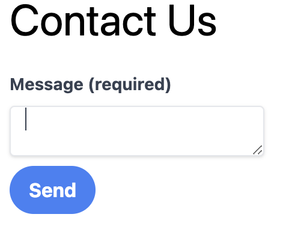

# Forms

In this exercise we will create a form to contact the conference. 

Something like this:

## Goals

* Create the Route file `contact-us.tsx`
* Add a Component which renders the form
* Create an `action` which reads the form data, then logs the message or saves it to the database.
  * `const message = formData.get("message");` will get the message from the form data.
  * Actually sending the message is out of scope for this exercise.
* Use the `useNavigation()` hook to disable the submit button while the form is submitting and show a loading indicator.
* The form should display error messages if the user does not enter a message.
* The form should display a success message when the message is sent.

The Remix documentation which covers everything you need to do is available here:

https://remix.run/docs/en/1.17.1/guides/data-writes and https://remix.run/docs/en/1.17.1/hooks/use-transition (https://remix.run/docs/en/1.17.1/hooks/use-navigation)

## Bonus

* Add a name and email field
* Use zod to do your form validation: https://www.remix-validated-form.io/zod-form-data